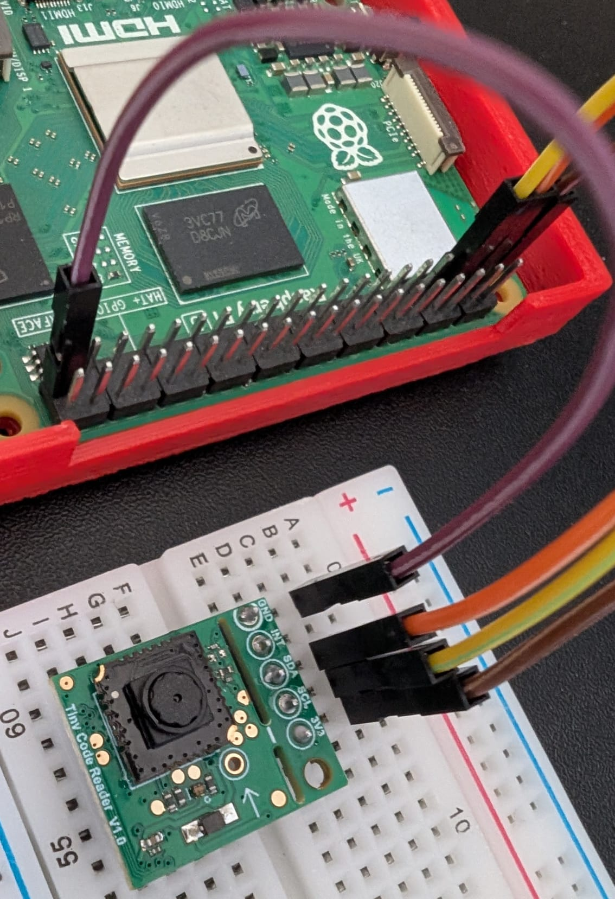

# tiny_code_reader_raspberry_pi
A simple python implementation for using the useful sensors tiny qr-code reader 


## Prerequisites on your Raspberry Pi
`sudo apt update`

`sudo apt install python3-smbus i2c-tools`


## Wiring



## Locating the qr-code device

Execute the following command after wiring the device to the raspberry pi:

`i2cdetect -y 1`

The output will display a map of the detected I2C devices. In this example, the device is located at 0C:
```     0  1  2  3  4  5  6  7  8  9  a  b  c  d  e  f
00:                         -- -- -- -- 0c -- -- --
10: -- -- -- -- -- -- -- -- -- -- -- -- -- -- -- --
20: -- -- -- -- -- -- -- -- -- -- -- -- -- -- -- --
30: -- -- -- -- -- -- -- -- -- -- -- -- -- -- -- --
40: -- -- -- -- -- -- -- -- -- -- -- -- -- -- -- --
50: -- -- -- -- -- -- -- -- -- -- -- -- -- -- -- --
60: -- -- -- -- -- -- -- -- -- -- -- -- -- -- -- --
70: -- -- -- -- -- -- -- --
```


## How to use
`python3 qr_code_reader.py`

Output:

```..Length: 67, Content: kaspa:qzfkkrqw64pg4vjfg9spk2rulut0xtxujwvg2dlf3t8n84ke3t22jt6vqz6tw
Length: 67, Content: kaspa:qzfkkrqw64pg4vjfg9spk2rulut0xtxujwvg2dlf3t8n84ke3t22jt6vqz6tw
Length: 67, Content: kaspa:qzfkkrqw64pg4vjfg9spk2rulut0xtxujwvg2dlf3t8n84ke3t22jt6vqz6tw
Length: 67, Content: kaspa:qzfkkrqw64pg4vjfg9spk2rulut0xtxujwvg2dlf3t8n84ke3t22jt6vqz6tw
Length: 67, Content: kaspa:qzfkkrqw64pg4vjfg9spk2rulut0xtxujwvg2dlf3t8n84ke3t22jt6vqz6tw
........Length: 67, Content: kaspa:qzfkkrqw64pg4vjfg9spk2rulut0xtxujwvg2dlf3t8n84ke3t22jt6vqz6tw
Length: 67, Content: kaspa:qzfkkrqw64pg4vjfg9spk2rulut0xtxujwvg2dlf3t8n84ke3t22jt6vqz6tw
Length: 67, Content: kaspa:qzfkkrqw64pg4vjfg9spk2rulut0xtxujwvg2dlf3t8n84ke3t22jt6vqz6tw
...Length: 30, Content: https://www.qrcode-monkey.com/
```
